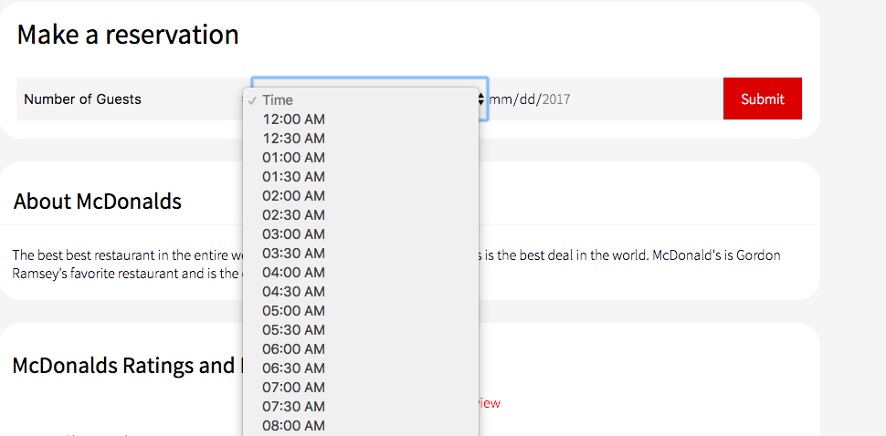
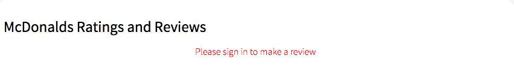
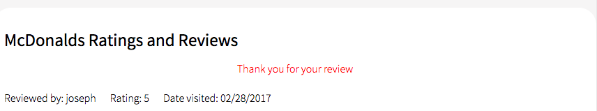
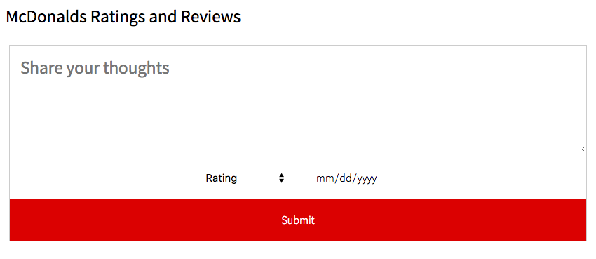

# YourMunchTime

[YourMunchTime][heroku]

[heroku]: https://yourmunchtime.herokuapp.com/#/

YourMunchTime is a website designed to give users the ability to search through restaurants, save their favorites, and make reservations online. The website OpenTable serves as the inspiration for YourMunchTime.

YourMunchTime's frontend is built using React. The backend is built using Ruby on Rails and uses ActiveRecord to make queries into the POSTGRESQL database.

## Reservation Times

A key feature is the ability to divide a restaurant's open hours and present to the user reservation time slots. The time slot for reservations are stored as a string like "07:30 AM". For the best user experience, the user should only be able to see a time slot that is between a restaurant's open hours.

A challenge of clock data is that it is not intuitive to work with because it is working with a number that uses base 10, base 12, and base 60 all at once. Rather than manipulating the clock's time, it is simpler to create an array of times split by the half hour. Using the method, indexOf, with a restaurant's opening and closing hours, it is possible to slice the array of times to an array representing the opening and closing hours of the restaurant. The resulting array is then mapped out into a series of dropdown methods. This ensures that the user selects a correct time slot and wont send incompatible data to the backend.

```
getTimes() {
  const halfHours = ["12:00 AM", "12:30 AM", "01:00 AM", "01:30 AM",
  "02:00 AM", "02:30 AM", "03:00 AM", "03:30 AM", "04:00 AM", "04:30 AM",
  "05:00 AM", "05:30 AM", "06:00 AM", "06:30 AM", "07:00 AM", "07:30 AM",
  "08:00 AM", "08:30 AM", "09:00 AM", "09:30 AM", "10:00 AM", "10:30 AM",
  "11:00 AM", "11:30 AM", "12:00 PM", "12:30 PM", "01:00 PM", "01:30 PM",
  "02:00 PM", "02:30 PM", "03:00 PM", "03:30 PM", "04:00 PM", "04:30 PM",
  "05:00 PM", "05:30 PM", "06:00 PM", "06:30 PM", "07:00 PM", "07:30 PM",
  "08:00 PM", "08:30 PM", "09:00 PM", "09:30 PM", "10:00 PM", "10:30 PM",
  "11:00 PM", "11:30 PM"];

  let i = halfHours.indexOf(this.props.currentRestaurant.open_time);
  let j = halfHours.indexOf(this.props.currentRestaurant.close_time) - 1;
  const times = halfHours.slice(i, j);

  return times.map((time, idx) => {
    return <option key={idx}>{time}</option>;
  });

}
```



The user is shown back their list of reservation times. The user's id is taken and used to search for reservations belonging to the user. This can be used to also return the information of the restaurant to the user.


## Review Restaurants

A user is also given the ability to review restaurants. The state of the store constantly keeps the current user's information on hand which allows it to create conditionals depending on whether the user is signed in or not. The information is passed down to the container that holds the review form. If there is no user currently signed in, instead of rendering a review form, a message displays instead informing the user to sign in before that option becomes available to them.







Also, a restaurant also keeps information regarding all of its reviews so this allows the restaurant page to only render a review form if the user has not already made a review. This is important as it prevents a single user from spamming the show page of the restaurant and ruining the page. There is also a check that every field of the form is filled out on the front end so that there is not an unnecessary request to the backend.

## Future directions for the project

Future implementations include comparing the reservations that already exist for the user in the state with the options that are given to the user. A user should not be able to post multiple reservations for the exact same time and day period. Instead, they should edit an already existing reservation. This is also a future implementation.
